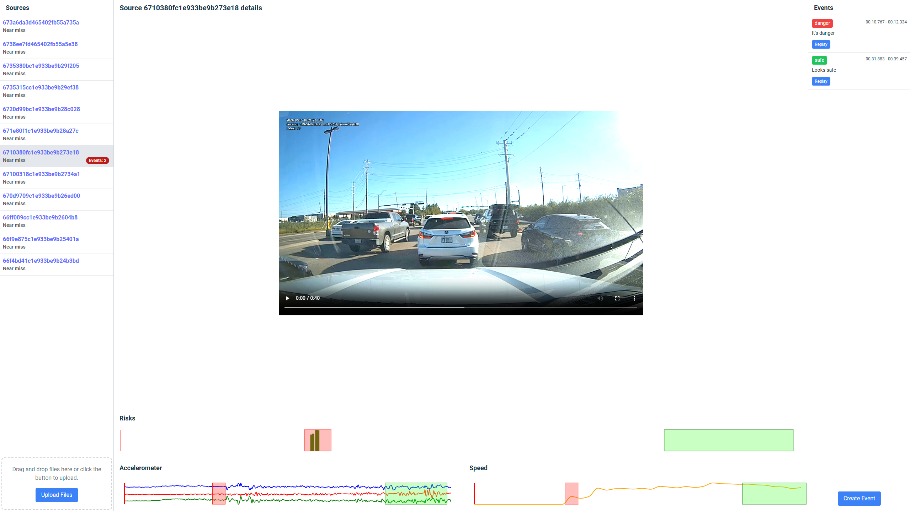

# event-processor

To run the project, execute the command:  
`docker-compose --profile prod up --build`

App will be available at the address  `http://localhost:8080`.

If the default port conflicts with other services on your system, you can modify it in the `.env` file.

To run in development mode, execute the command:  
`docker-compose --profile dev up --build`

In development mode, additional features are available:
- Debugging Go code (port 2345)
- Hot reload for the backend using Air
- Hot reload for the frontend.

This app allows you to:
- View videos and JSON data uploaded via the `UPLOAD` button in the `source list`.
- Create, view, and delete events.

## How to create an event:
1. Set the cursor to the desired position in the video where you want to start the event.
2. Click the `CREATE EVENT` button.
3. Navigate to the timestamp where you want to end the event and click the `SET END TIME` button.
4. In the modal window that appears:
    - Enter the name and type of the event.
    - Click `CREATE`.


## Example:


## API:
 To get a list of events, send a GET request to the `/events` endpoint.
 ```
    curl -X GET http://localhost:8080/api/events
 ```

 Filter events by type:
 ```
    curl -X GET http://localhost:8080/api/events?type=danger
 ```